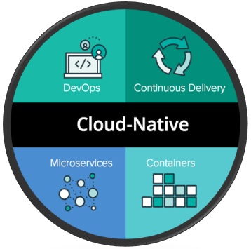

네이버, 카카오, 토스 등등 규모가 큰 IT 서비스 기업들은 각자의 tech 유튜브 채널을 가지고 있으며, 서버쪽 내용을 보면 대부분 MSA(Micro Service Architecture)를 적용한 서비스 구조를 갖고 있다. 결국 현재 현업에서 설득력있는 구조가 바로 MSA임을 보여주는 사례라고 생각한다. 그리고 MSA를 알아보다 보면 현재의 개발 트렌드를 읽을 수 있을거라 생각한다.

# Cloud Computing

AWS, GCP, Naver Cloud는 공통적으로 클라우드 컴퓨팅 서비스를 제공하고 이는 서비스 인프라를 구축하는데 이점을 제공한다. 전통적으로 인프라를 구성하는 방식은 실제 서버용 컴퓨터를 마련하고 데이터 센터를 유지해야 했다. 하지만 최근 트렌드는 인프라의 실제 위치를 서비스 운영자가 특정할 수 없어도 인프라를 구축하고 확장역시 유연하게 할수 있는 `클라우드`기술이 자리매김하였다.

# Cloud Native Application

앞서 소개한 클라우드의 핵심은 구체적인 실체를 숨긴채 서비스를 위한 인프라를 구축할 수 있다는 것이다. 하지만 클라우드를 통해 획득한 컴퓨팅 자원 역시 관리해야하는 대상이기에 IP주소를 특정하는 등 그 실체를 완벽히 숨기지는 못한다. 이는 본래 클라우드의 목적과 상반되는 점이고, 이를 보완하는 `Cloud Native`라는 개념이 등장한다.

Cloud Native의 등장 배경상 Cloud Native의 역할은 클라우드가 클라우드 다울 수 있도록 어플리케이션을 구축, 실행하는 것이다. "**클라우드를 더욱 클라우드 답게**".. 다소 추상적인 설명이다. 이를 조금 더 구체화 시키면 `서로 간의 관계를 추상화된 형태로 접근해 사용할 수 있도록 Network 주소 기반이 아닌 별도의 end-point를 제공해 통신하는 방식`이 된다.

  

위 사진은 Cloud-Native를 위한 컴포넌트를 나타낸다. 그리고 MicroService가 컴포넌트로 있는 것을 확인할 수 있으며 MSA(Microservices Architecture)는 클라우드를 더욱 클라우드 답게 사용하기 위한 과정이라고 이해할 수 있을 것 같다.

# Microservice Architecture

큰 서비스를 구성하기 위해 여러개의 작은 서비스로 구성하는 구조를 `Microservice Architecture` 라 하고 모듈화 된 작은 서비스 각각을 `Microservice`라 한다.

James Lewis와 Martin Fowler는 Microservice에 대해 다음과 같이 말하였다.

> There is a bare minimum of centralized management of these services, which may be written in different programming languages and use different data stroage technologies.

MicroServices는 중앙 집중방식으로 최소한으로 관리되어야하고, 다른 개발 언어, 다른 DB를 사용할 수 있음을 의미한다. 즉, 각 Micoservice는 다른 MicoService와는 별개로 개발되어야 하며 각 서비스간 통신도 해당 서비스끼리 알아서 해야한다는 것이다. 추가로 MSA에서 서비스간 통신은 각 Microservice에서 노출한 Restful API를 통해 이루어지고, 데이터 동기화를 위해 Kafka같은 이벤트 스트림 플랫폼을 활용한다.

# Reference

https://www.inflearn.com/course/%EC%8A%A4%ED%94%84%EB%A7%81-%ED%81%B4%EB%9D%BC%EC%9A%B0%EB%93%9C-%EB%A7%88%EC%9D%B4%ED%81%AC%EB%A1%9C%EC%84%9C%EB%B9%84%EC%8A%A4

https://medium.com/naver-cloud-platform/master-%EA%B8%B0%EC%88%A0-%EA%B2%BD%ED%97%98-%EA%B3%B5%EC%9C%A0-%ED%81%B4%EB%9D%BC%EC%9A%B0%EB%93%9C-cloud-vs-%ED%81%B4%EB%9D%BC%EC%9A%B0%EB%93%9C-%EB%84%A4%EC%9D%B4%ED%8B%B0%EB%B8%8C-cloud-native-%EC%A0%84%EA%B2%A9-%EB%B9%84%EA%B5%90-f167fc8bc32e
