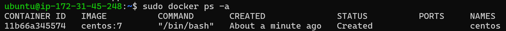
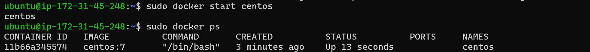
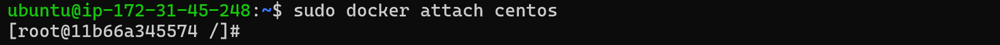
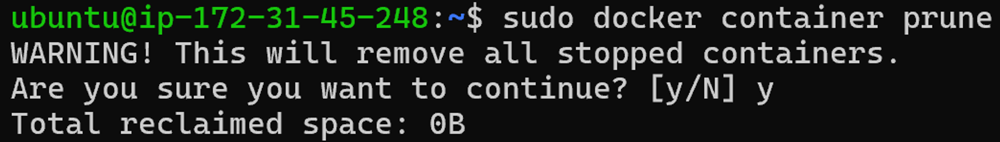
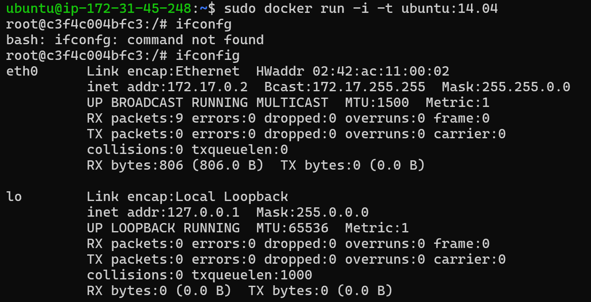
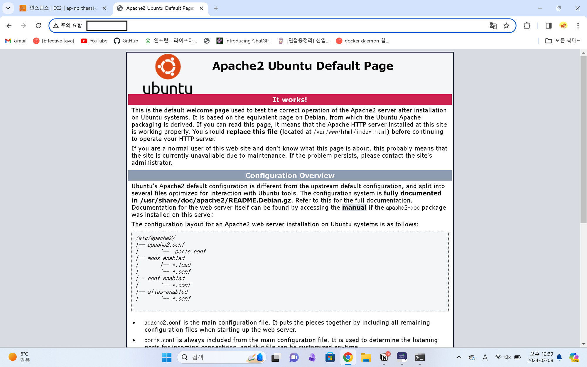

도커 엔진에서는 도커 이미지 와 도커 컨테이너를 기본 단위로 사용합니다. 도커 이미지는 도커 컨테이너를 생성하는데 사용하는 iso 파일과 비슷한 개념이고, 도커 컨테이너는 파일 시스템과 격리된 시스템 자원을 사용할 수 있는 독립된 공간입니다.

**도커 이미지**

도커 이미지는 도커 컨테이너를 생성하는 기반이되고, 여러 개의 계층으로 된 바이너리 파일로 존재합니다.

이미지의 이름은 [저장소 이름]/[이미지 이름]:[태그]의 포맷으로 저장됩니다.

**도커 컨테이너**

도커 이미지로 부터 도커 컨테이너가 생성되는데, 다양한 어플리케이션을 실행할 수 있는 독립된 공간입니다. 호스트 머신의 자원을 사용하지만, 독립된 공간이기에 도커 컨테이너의 문제가 다른 컨테이너 혹은 호스트 머신으로 전파되지 않습니다.

컨테이너는 이미지를 읽기 전용으로 하기에, 컨테이너에서 무엇을 하든 원래 이미지에는 영향을 끼치지 않습니다.

## 컨테이너 생성

```bash
docker run -i -t ubuntu:14.04
```

- `docker run:` 컨테이너를 생성하고 실행하는 명령어
- `-i:` 컨테이너의 STDIN을 열린 상태로 유지하는 옵션
  - 컨테이너에서 사용자의 입력을 받을 수 있도록 하는 옵션입니다.
- `-t:` pseudo-TTY 을 할당하는 옵션
  - tty를 활성화하여 배시쉘을 사용할 수 있습니다.
  - 컨테이너에게 명령을 내릴 수 있도록 하는 터미널을 부착합니다.

> -t 옵션을 사용하지 않고 -i만 사용하더라도 명령을 내릴 수 있지만, 터미널의 기능은 사용하지 못함. -t를 같이 사용하는 경우가 더 편하게 명령을 내릴 수 있음

도커 컨테이너와 연결된 쉘에서 빠져 나올 때는 `exit` 명령어 또는 `Ctrl + D` 를 입력하는데 이는 빠져나오는 동시에 컨테이너를 중지시킵니다. 컨테이너를 중지 시키지 않고 빠져 나오려면, `Ctrl + P,Q` 를 입력하면 됩니다.

```bash
docker create -i -t --name centos centos:7
```

- centos:7 이미지를 centos라는 이름으로 컨테이너를 생성합니다.
  - 컨테이너를 생성만하고 실행하지는 않습니다.
  - 컨테이너에 명령을 내릴 때 `--name` 으로 부착한 이름을 사용할 수 있습니다.
- -i, -t 옵션은 위에 설명과 동일합니다.

시작하지 않고 생성된 상태의 컨테이너는 `docker start` 명령어를 통해 실행할 수 있습니다. 그리고 실행된 컨테이너 내부로 들어갈 때는 `docker attach` 명령어를 사용합니다.



컨테이너가 시작 중인 아닌 상태에서 `docker start` 명령어를 사용하면 아래와 같이 실행중을 의미하는 Up 상태로 변하게 됩니다. 이때 실행을 하더라도 컨테이너 내부로는 들어가지 않습니다.



컨테이너 내부로 들어가기 위해서는 `docker attach` 명령어를 사용합니다.



## 컨테이너 삭제

생성된 컨테이너를 삭제할 때는 `docker rm` 명령어를 사용합니다. 하지만 삭제하려는 컨테이너가 실행중이면 `docker rm` 으로는 삭제할 수 없습니다. 그래서 `docker rm -f` 로 강제로 삭제하거나 `docker stop` 으로 컨테이너를 중지 시킨뒤 `docker rm` 으로 삭제해야합니다.

**모든 컨테이너를 삭제하는 방법**

- `docker container prune` : 중지된 컨테이너를 모두 삭제합니다.
  
- 다른 방법

  ```bash
  docker stop $(docker ps -a -q) -- 1
  docker rm $(docker ps -a -q) -- 2
  ```

  - 1번 명령은 모든 컨테이너를 중지 시키는 명령입니다.
  - 2번 명령은 모든 컨테이너를 삭제하는 명령입니다.
  - `-q` : 컨테이너 ID만 리스트로 출력하는 옵션입니다.

## 컨테이너 네트워크

컨테이너는 생성될때 가상 IP 주소를 할당 받고, 별도의 설정이 없으면 컨테이너는 `172.17.0.x` 를 순차적으로 할당받습니다.



별다른 설정 없이 생성된 컨테이너는 외부에서 접근할 수 없이 호스트로부터의 접근만 허용합니다. 호스트 외부에서 도커 컨테이너에 접근하기 위해서는 컨테이너의 `IP`와 `포트`를 호스트의 `IP`와 `포트`에 매핑 시켜줘야합니다.

**포트 매핑**

```bash
sudo docker run -i -t --name webserver -p 80:80 ubuntu:14.04
```

- `-p` : [호스트 포트]:[컨테이너 포트] 형식으로 포트를 매핑할 때 사용하는 옵션
  - 호스트 포트를 명시하지 않고, `-p n` 이라 사용하면 컨테이너의 n번 포트를 호스트에서 사용 가능한 포트를 임의로 매핑합니다. 호스트에서 매핑된 포트는 `docker ps` 명령어의 결과값에서 PORTS 항목을 통해 알 수 있습니다.

```bash
sudo docker run -i -t -p 3306:3306 -p 192.168.0.100:7777:80 ubuntu:14.04
```

- `docker run` 명령어를 통해 포트를 1개가 아닌 여러개를 동시에 매핑해야하는 상황이 있을 수도 있습니다. 이럴 때는 `-p` 옵션을 여러개 사용합니다. 또한, host의 특정 IP를 사용하는 경우 이를 명시해 지정할 수 있습니다.
- `-p 192.168.0.100:7777:80` : 호스트의 192.168.0.100 IP주소를 가진 7777번 포트를 컨테이너의 80번 포트와 매핑

```bash
sudo docker run -i -t --name webserver -p 80:80 ubuntu:14.04
```

앞서 실행시킨 뒤 접속한 컨테이너에서 아파치 서버를 설치합니다.

```bash
apt-get update
apt-get install apache2 -y
```

설치를 완료하고 아파치를 실행시킵니다.

```bash
service apache2 start
```

호스트 IP의 80번 포트로 연결하면, 도커 컨테이너의 80번 포트와 연결되는데, 80번 포트는 apache 프로그램이 실행되는 곳이므로, 아파치 기본 화면이 보입니다.

> **호스트 IP 80번 포트 → 도커 컨테이너 80번 포트 → 아파치 웹 서버 접근**


